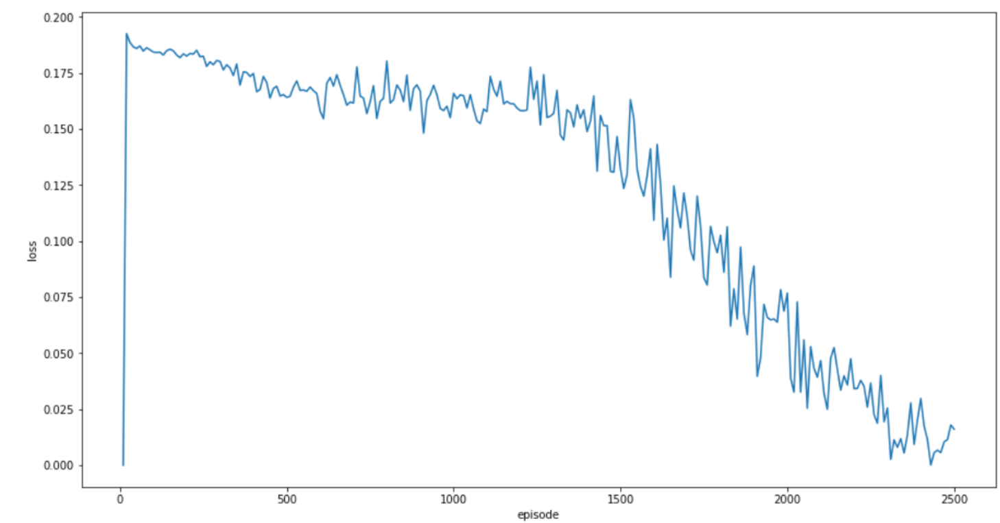
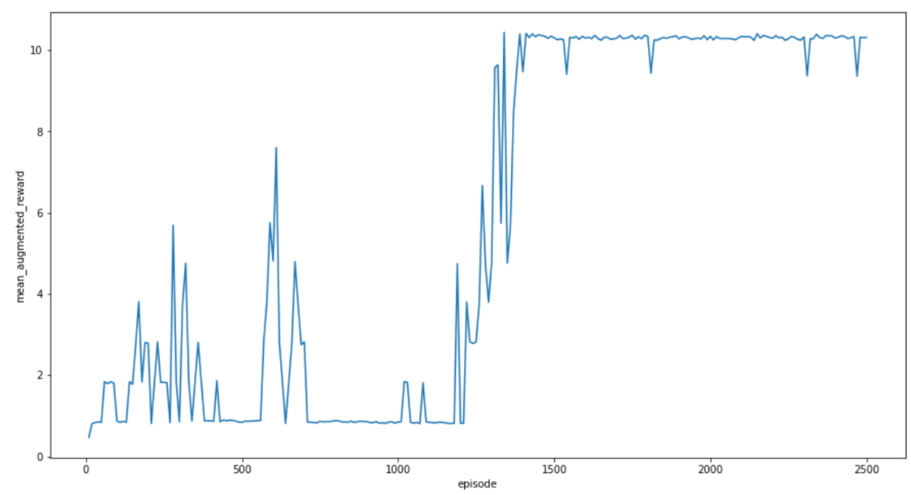

# Never-Give-Up
Implementation of the paper 'Never Give Up: Learning Directed Exploration Strategies' ICLR 2020 best paper
## Research Paper
A reinforcement learning method is proposed to solve hard exploration games. This is done by learning different directed exploration policies. An episodic memory-based intrinsic reward is constructed using k-nearest neighbours on the agent’s nearest experiences. This method encourages the agent to repeatedly revisit all states in its environment. The embeddings of the nearest lookup are trained using a self-supervised inverse dynamics model. A framework of Universal Value Function Approximators (UVFA) is employed to simultaneously learn multiple directed exploration policies (exploration/exploitation trade-off) with the same neural network. By using the same neural network for different degrees of exploration/exploitation, transfer is demonstrated from predominantly exploratory policies yielding effective exploitative policies. The proposed method can be incorporated to run with modern distributed RL agents that collect large amounts of experience from many agents running in parallel on separate environment instances.
## Architecture
The paper proposes the use of a universal value function approximator (UVFA) to simultaneously approximate the optimal value function with respect to a family of augmented rewards. In this way, one can turn-off exploratory behaviour simply by acting greedily with respect to the setting of the hyperparameter β, which moderates the exploration and ranges from 0 to β_N where 0 turns off exploratory behaviour. The paper adapts the R2D2 agent with an LSTM layer after a convolutional neural network in case of images being provided. Since we have defined the environment itself, there is no need for images of Atari games and hence
convolutional layers are not needed.
## Results
The following are the plots for the variation of loss and mean augmented reward for the model implementation on the game Gridworld-

## Analysis
The reinforcement learning agent presented in the paper is equally effective for both sparse and dense reward scenarios. The method was implemented on a different game, Gridworld, which is different from the one presented in the paper, Pitfall! The results from both games showed a similar variation in loss and the mean augmented reward with the number of episodes. Computational time is significantly reduced by running it on a distributed training architecture that enables multiple agents to run simultaneously in different environments. Further, the episodic novelty measure relies on the notion of controllable states to drive exploration. As observed on the Atari hard-exploration games, this strategy performs well on several tasks, but it may not be the right signal for some environments. For instance, in some environments it might take more than two consecutive steps to see the consequences of the actions taken by the agent. An interesting line for future research is learning effective controllable states beyond a simple inverse dynamics model. The hyperparameter β depends on the scale of the extrinsic reward. Different values of β might be suitable for different environments depending on the scale. Another scope for future research could be using a dynamic value of β depending on the environment in the game. An advantage of this would be that the model would become completely exploitative when the agent has reached a point in which further exploring does not lead to improvements on the exploitative policy.
